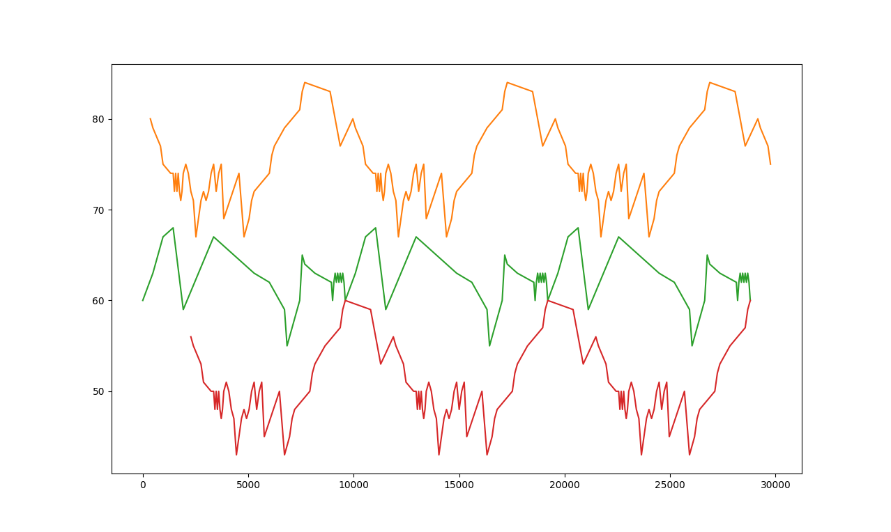
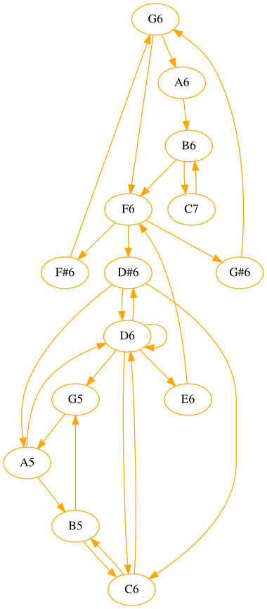
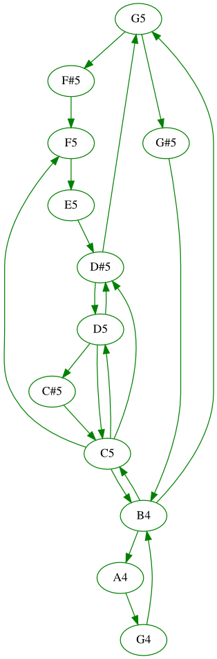
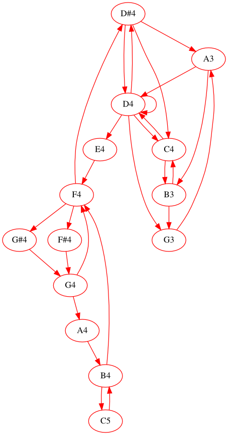

Moved here:
<https://codeberg.org/rgarcia-herrera/midi-time-graph>

# Time Series

This script will line-plot note events from midi tracks.

For example J.S. Bach's [Canon perpetuus super thema regium](http://www.jsbach.net/midi/1079-02.mid) taken from 
[here](http://www.jsbach.net/midi/midi_musicaloffering.html).

Run thusly

    $ python plot_midi.py 1079-02.mid

will plot this:

# Directed Graph
<table>
<tr>
<td></td>
<td></td>
<td></td>
</tr>
</table>

Nice string trio :-)
